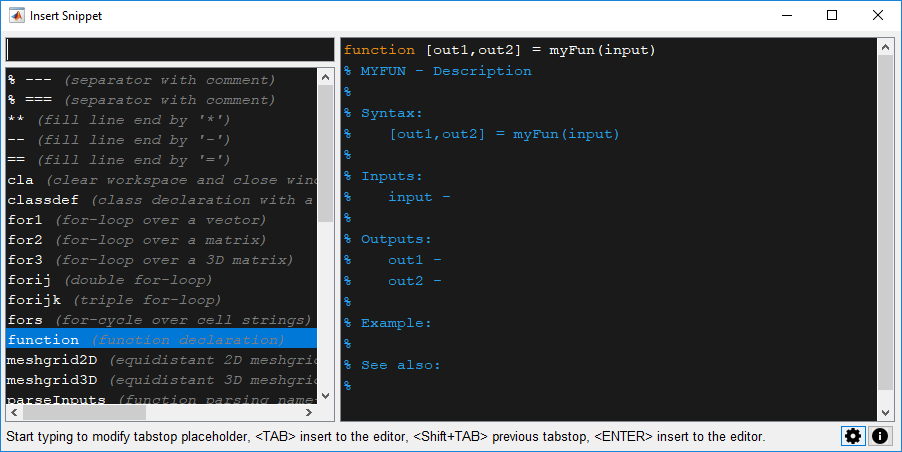
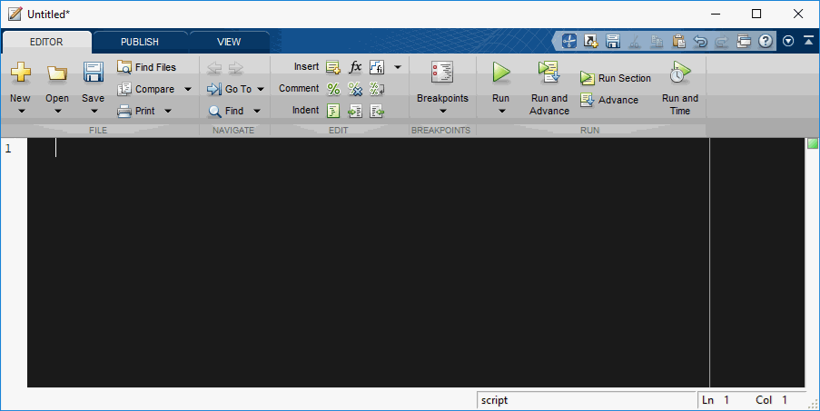
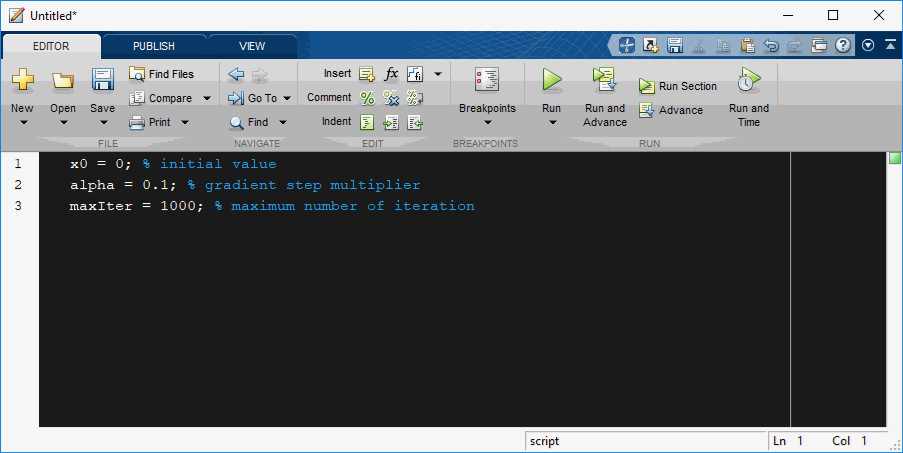
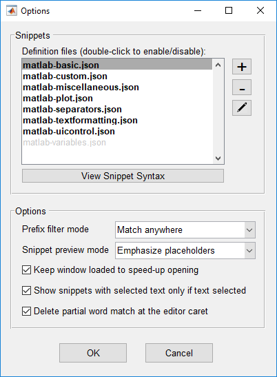

# MATLAB Snippets App
MATLAB Snippets App adds code snippets to the Matlab editor. Snippets definition uses syntax compatible with the [Visual Studio Code](https://code.visualstudio.com/docs/editor/userdefinedsnippets) and with the [Textmate 1.x](https://macromates.com/manual/en/snippets). The integration to the Matlab editor is loose, the snippets are inserted by a keyboard shortcut (usually **ALT+1**).

## Installation
Download the app package [MATLAB Snippets.mlappinstall](https://github.com/trnkap/matlab-snippets/raw/master/MATLAB%20Snippets.mlappinstall) and run it on your computer or install it using the "Install App" button on the Matlab "APPS" ribon. The app icon "MATLAB Snippets" will appear on the "APPS" ribon. Clicking on it for the first time offers you to create a shortcut on the Quick Access Toolbar.

This is important, because each shortcut on the Quick Access Toolbar is associated with a keyboard shortcut. The first position from the left is associated with the **ALT+1** keyboard shortcut.

## Using MATLAB Snippets
Press **ALT+1** in the Matlab editor to open the "Insert Snippet" window.

It shows a list of available snippets on the left. For each snippet it displays its prefix and a short description. The list of snippets can be filtered by typing to the top left edit box (focused by default). Snippets can be selected by the up/down arrows. The selected snippet is previewed in the right pane. All available actions and keyboard shortcuts for each step are shown in the bottom status bar.

Press **ENTER** to insert the selected snippet to the Matlab editor. Most snippets have tabstops that allows you to modify the snippet before inserting it to the Matlab editor. To start snippet modification press **TAB** instead of **ENTER**. The cursor will move to the position of the first tabstop where you can either modify the existing placeholder or you can start to type a new value. Pressing **TAB** again will move the cursor to the next tabstop or it will insert the snippet to the Matlab editor if it was the last tabstop. By pressing **Shift+TAB** you can move to the previous tabstop. Note that you can modify only the text of the current tabstop. The cursor can move arbitrarily; however, any changes out of the currently selected tabstop will be discarded.

The window can be closed anytime without any action by **ESC**.
Each tabstop can be mirrored on multiple locations in the snippet. Target tabstops can adjust the mirrored value by a regular expression and by calling Matlab functions. Tabstops can be also nested, which allows you typically to delete or overwrite a complex placeholder or modify nested tabstops. These features will be shown in the animated examples.
Note that window elements are using the same graphical style as the Matlab editor (font type, font size, syntax coloring, etc.),

## Example - Inserting a simple snippet
The animation shows a simple snippet for the double for-loop. After the snippet is selected from the list, use **TAB** to jump to the first tabstop, where you can modify the default placeholder. Press **TAB** again to jump to the next tabstop. Notice that at the first tabstop you can either modify the placeholder `"1 : m"` or you can jump to the second placeholder to modify only the `"m"` (nested placeholders).

Alternatively the prefix can be partially or fully specified in the Matlab editor before pressing **ALT+1**. If the text at the current editor caret matches with some snippet prefix then this snippet is either immediately inserted to the Matlab editor (if it has no tabstops) or the snippet window opens in the tabstop editing mode.

## Example - Inserting a complex snippet
The animation shows a more complex snippet for a function header. Notice that the input and output argument names are automatically mirrored in the "Syntax" section and also a detailed description of each argument is prepared in the "Inputs" or "Outputs" section. Similarly the function name is mirrored in the "Syntax" section and also mirrored in the uppercase in the first comment line. This is achieved by the regular expressions in the snippet definition.

## Example - Inserting a snippet without tabstops
Snippets without tabstops can be quickly inserted without opening the snippet window by typing its prefix and pressing **ALT+1**.

## Example - Selected text formatting
Selecting a block of text in the Matlab editor and pressing **ALT+1** gives a list of snippets that can format it. For example it can be used to align specific symbols like `'='` and `'%'`.

## Options
The options window has a list of the loaded snippet definition files. Double-clicking the file names will enable and disable them. Clicking on the edit button (with the pen icon) will open the snippet json file in the Matlab editor. Click the "View Snippet Syntax" button to view the snippet file syntax in the external web browser (a link to the Visual Studio Code documentation).

You can select these snippet preview modes:

## Undocumented Matlab Functions
Some features were possible only by using undocumented Matlab functions that may change or break in future Matlab releases. The App was tested in Matlab R2016a, R2018b, R2021b and R2023a.

## Acknowledgement
This is all really trnkap's work in https://github.com/trnkap/matlab-snippets from which this repo is forked. All I did was updated some lines of code which were pointed out by the user 'gloo' in the matlab file exchange](https://uk.mathworks.com/matlabcentral/discussions/fx-comments/ref/90d1927f-ebcd-419f-bb48-52590267fc4d?embed=true#).

Inspired by the ["Insert a piece of code (a snippet) in the Matlab editor"](https://www.mathworks.com/matlabcentral/fileexchange/41704-insert-a-piece-of-code-a-snippet-in-the-matlab-editor).

Inspired by the ["MATLAB for Visual Studio Code"](https://marketplace.visualstudio.com/items?itemName=Gimly81.matlab).

Uses the ["JSONlab"](https://github.com/fangq/jsonlab) to decode JSON files for Matlab R2016a and earlier.

Uses code based on the ["findjobj"](https://www.mathworks.com/matlabcentral/fileexchange/14317-findjobj-find-java-handles-of-matlab-graphic-objects) to find java handles of Matlab graphic objects.
